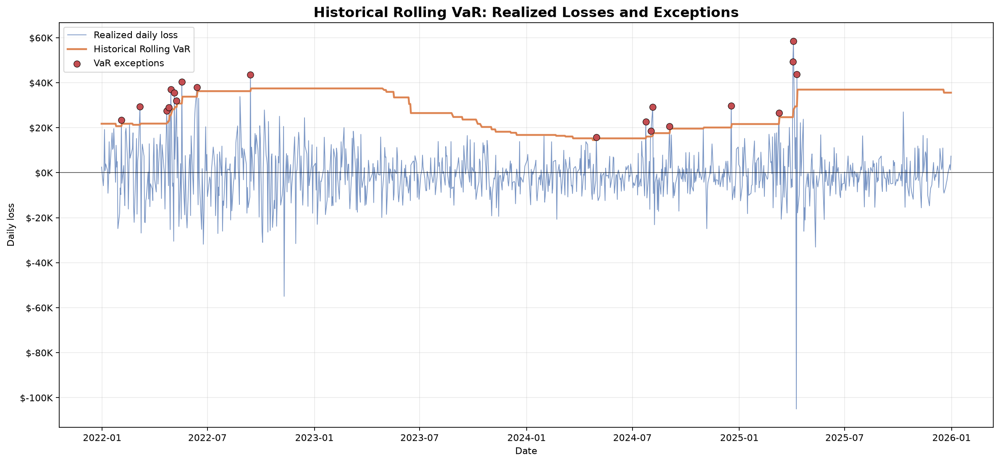
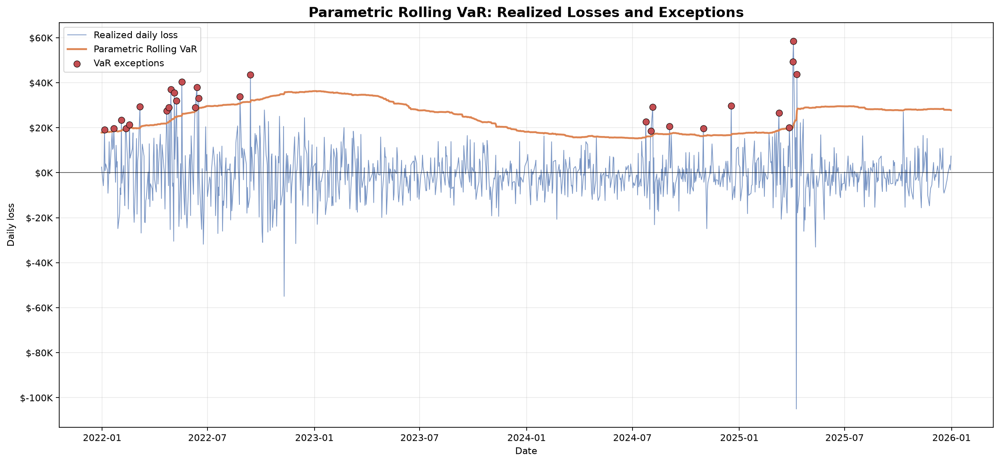
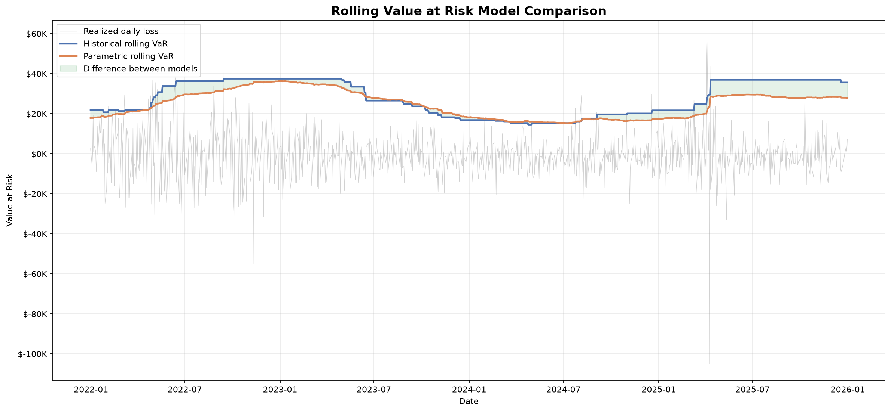

# Financial Risk Backtesting Engine

Quantitative market-risk measurement and Value at Risk backtesting engine
developed in Python.

The project estimates financial risk using historical, parametric and
Monte Carlo methods. It generates rolling VaR forecasts and evaluates
their statistical reliability using Kupiec, Christoffersen, conditional
coverage and Basel traffic-light tests.

> [English](#english) | [Español](#español)

---

# English

## Overview

This project implements an end-to-end quantitative market-risk workflow:

```text
Market prices
    ↓
Daily returns
    ↓
Monetary losses
    ↓
Risk estimation
    ↓
Rolling VaR forecasts
    ↓
Exception identification
    ↓
Statistical backtesting
```

The empirical analysis uses adjusted historical prices for the SPDR
S&P 500 ETF Trust (`SPY`) and evaluates a hypothetical portfolio worth
$1,000,000.

## Main features

- Historical Value at Risk
- Historical Expected Shortfall
- Parametric normal VaR
- Parametric normal Expected Shortfall
- Monte Carlo risk simulation
- Antithetic variance reduction
- Rolling historical VaR
- Rolling parametric VaR
- Out-of-sample forecast alignment
- VaR exception identification
- Kupiec unconditional coverage test
- Christoffersen independence test
- Conditional coverage test
- Basel traffic-light classification
- Yahoo Finance market-data integration
- Professional risk visualizations
- Detailed mathematical notebook
- Automated test suite

## Mathematical models

### Returns

Simple daily returns are calculated as:

$$
R_t=\frac{P_t}{P_{t-1}}-1
$$

### Monetary losses

For a portfolio with value \(V\):

$$
L_t=-VR_t
$$

This convention represents losses as positive values and gains as
negative values.

### Historical VaR

$$
\operatorname{VaR}_{\alpha}^{\mathrm{hist}}
=
Q_{\alpha}(L_1,L_2,\ldots,L_n)
$$

### Parametric normal VaR

Assuming:

$$
R_t\sim\mathcal{N}(\mu,\sigma^2)
$$

the one-day parametric VaR is:

$$
\operatorname{VaR}_{\alpha}^{\mathrm{normal}}
=
V(\sigma z_{\alpha}-\mu)
$$

### Expected Shortfall

$$
\operatorname{ES}_{\alpha}
=
E
\left[
L
\mid
L>\operatorname{VaR}_{\alpha}
\right]
$$

### Monte Carlo simulation

$$
R_i^{(s)}
=
\hat{\mu}
+
\hat{\sigma}Z_i,
\qquad
Z_i\sim\mathcal{N}(0,1)
$$

$$
L_i^{(s)}
=
-VR_i^{(s)}
$$

### Rolling VaR

For a rolling window of size \(w\), the forecast for day \(t\) uses only
information available before that day:

$$
\mathcal{W}_t
=
\{R_{t-w},\ldots,R_{t-1}\}
$$

This prevents look-ahead bias.

## Backtesting methodology

### VaR exceptions

An exception occurs when realized loss exceeds forecast VaR:

$$
I_t
=
\mathbf{1}
\left(
L_t>\operatorname{VaR}_{\alpha,t}
\right)
$$

### Kupiec test

The Kupiec test evaluates whether the observed exception rate equals the
theoretical rate:

$$
p=1-\alpha
$$

Its likelihood-ratio statistic is:

$$
LR_{\mathrm{uc}}
=
-2
\ln
\left(
\frac{\mathcal{L}_0}{\mathcal{L}_1}
\right)
$$

### Christoffersen test

The Christoffersen test evaluates whether exceptions occur independently
through time:

$$
LR_{\mathrm{ind}}
=
-2
\ln
\left(
\frac{\mathcal{L}_{\mathrm{independent}}}
{\mathcal{L}_{\mathrm{Markov}}}
\right)
$$

### Conditional coverage

$$
LR_{\mathrm{cc}}
=
LR_{\mathrm{uc}}
+
LR_{\mathrm{ind}}
$$

### Basel traffic-light framework

For a 250-day backtest at 99% confidence:

| Zone | Exceptions | Interpretation |
|---|---:|---|
| Green | 0–4 | Broadly acceptable |
| Yellow | 5–9 | Additional review required |
| Red | 10 or more | Strong evidence of underestimated risk |

## Empirical results

The rolling analysis used:

| Parameter | Value |
|---|---:|
| Asset | SPY |
| Market period | 2021-01-04 to 2025-12-31 |
| Portfolio value | $1,000,000 |
| Confidence level | 99% |
| Rolling window | 250 trading days |
| Out-of-sample forecasts | 1,004 |

### Historical rolling VaR

| Metric | Result |
|---|---:|
| Average VaR | $27,690.76 |
| Minimum VaR | $14,525.11 |
| Maximum VaR | $37,472.07 |
| Expected exceptions | 10.04 |
| Actual exceptions | 20 |
| Exception rate | 1.99% |
| Kupiec p-value | 0.005382 |
| Christoffersen p-value | 0.060668 |
| Conditional coverage p-value | 0.003579 |

### Parametric rolling VaR

| Metric | Result |
|---|---:|
| Average VaR | $24,653.76 |
| Minimum VaR | $15,264.68 |
| Maximum VaR | $36,313.29 |
| Expected exceptions | 10.04 |
| Actual exceptions | 28 |
| Exception rate | 2.79% |
| Kupiec p-value | 0.000003 |
| Christoffersen p-value | 0.045229 |
| Conditional coverage p-value | 0.000002 |

The historical model performed better in relative terms, but neither
model achieved adequate conditional coverage over the complete
evaluation period.

## Visualizations

### Historical rolling VaR



### Parametric rolling VaR



### Model comparison



## Project structure

```text
financial-risk-backtesting-engine/
├── docs/
│   └── methodology.md
├── notebooks/
│   └── risk_backtesting_analysis.ipynb
├── results/
│   └── figures/
│       ├── historical_var_backtest.png
│       ├── parametric_var_backtest.png
│       └── var_model_comparison.png
├── src/
│   ├── __init__.py
│   ├── backtesting.py
│   ├── christoffersen.py
│   ├── data_loader.py
│   ├── market_backtest.py
│   ├── risk_metrics.py
│   ├── rolling_var.py
│   ├── simulation.py
│   ├── var_models.py
│   └── visualization.py
├── tests/
├── .gitignore
├── LICENSE
├── README.md
└── requirements.txt
```

## Installation

Clone the repository:

```powershell
git clone https://github.com/acarrillofintech/financial-risk-backtesting-engine.git
cd financial-risk-backtesting-engine
```

Create and activate a virtual environment on Windows:

```powershell
py -m venv .venv
.\.venv\Scripts\Activate.ps1
```

Install the dependencies:

```powershell
python -m pip install --upgrade pip
python -m pip install -r requirements.txt
```

## Usage

Run the individual risk modules:

```powershell
python -m src.risk_metrics
python -m src.var_models
python -m src.simulation
python -m src.backtesting
python -m src.christoffersen
python -m src.rolling_var
```

Run the complete real-market backtest:

```powershell
python -m src.market_backtest
```

Generate the figures:

```powershell
python -m src.visualization
```

Run the automated tests:

```powershell
python -m pytest -q
```

Expected result:

```text
179 passed
```

## Notebook and documentation

The detailed mathematical analysis is available in:

```text
notebooks/risk_backtesting_analysis.ipynb
```

The formal methodology is available in:

```text
docs/methodology.md
```

## Technologies

- Python 3.14
- NumPy
- pandas
- SciPy
- Matplotlib
- seaborn
- yfinance
- Jupyter
- pytest
- Git and GitHub

## Limitations

- Historical observations may not represent future market regimes.
- Normal models may underestimate fat-tailed losses.
- Equal-weight rolling windows can react slowly.
- Monte Carlo accuracy depends on its probability model.
- VaR does not describe the magnitude of losses beyond its threshold.
- This implementation does not include liquidity or transaction costs.
- The empirical example represents a single market asset.

## Disclaimer

This project is intended for educational, research and portfolio
demonstration purposes. It does not constitute investment advice,
financial advice or a production regulatory-risk system.

---

# Español

## Descripción

Este proyecto implementa un motor cuantitativo de medición y validación
de riesgo de mercado.

El sistema descarga precios históricos, calcula rendimientos y pérdidas,
genera pronósticos móviles de Valor en Riesgo y evalúa estadísticamente
si esos pronósticos fueron confiables.

El análisis empírico utiliza precios ajustados del ETF SPY y un
portafolio hipotético de $1,000,000.

## Funcionalidades

- Valor en Riesgo histórico.
- Expected Shortfall histórico.
- VaR paramétrico normal.
- Expected Shortfall paramétrico.
- Simulación Monte Carlo.
- Variables antitéticas.
- VaR histórico móvil.
- VaR paramétrico móvil.
- Pronósticos fuera de muestra.
- Identificación de excepciones.
- Prueba de cobertura de Kupiec.
- Prueba de independencia de Christoffersen.
- Prueba de cobertura condicional.
- Semáforo regulatorio de Basilea.
- Descarga de datos desde Yahoo Finance.
- Gráficos profesionales.
- Notebook matemático detallado.
- Pruebas automáticas.

## Interpretación principal

Un modelo VaR al 99% debería ser superado aproximadamente en el 1% de
los días.

En el análisis se esperaban 10.04 excepciones:

- El modelo histórico produjo 20.
- El modelo paramétrico produjo 28.

El VaR histórico funcionó mejor en términos relativos, pero ambos
modelos fallaron la prueba de cobertura condicional.

Este resultado demuestra que calcular un VaR no es suficiente. El modelo
debe compararse con pérdidas reales y someterse a pruebas estadísticas.

## Instalación

```powershell
git clone https://github.com/acarrillofintech/financial-risk-backtesting-engine.git
cd financial-risk-backtesting-engine
py -m venv .venv
.\.venv\Scripts\Activate.ps1
python -m pip install -r requirements.txt
```

## Ejecución

Backtesting completo con datos reales:

```powershell
python -m src.market_backtest
```

Generación de gráficos:

```powershell
python -m src.visualization
```

Pruebas automáticas:

```powershell
python -m pytest -q
```

Resultado esperado:

```text
179 passed
```

## Documentación

El análisis interactivo se encuentra en:

```text
notebooks/risk_backtesting_analysis.ipynb
```

La metodología matemática completa se encuentra en:

```text
docs/methodology.md
```

## Conclusión

El proyecto conecta matemáticas financieras, probabilidad, simulación,
estadística, programación, visualización y validación de modelos.

El flujo completo es:

```text
Precios
→ Rendimientos
→ Pérdidas
→ Pronósticos VaR
→ Excepciones
→ Pruebas estadísticas
→ Evaluación del modelo
```

## Licencia

Este proyecto se distribuye bajo la licencia MIT.